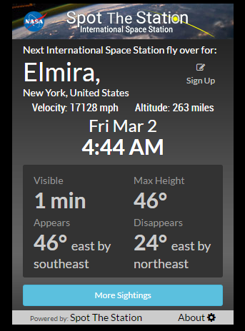
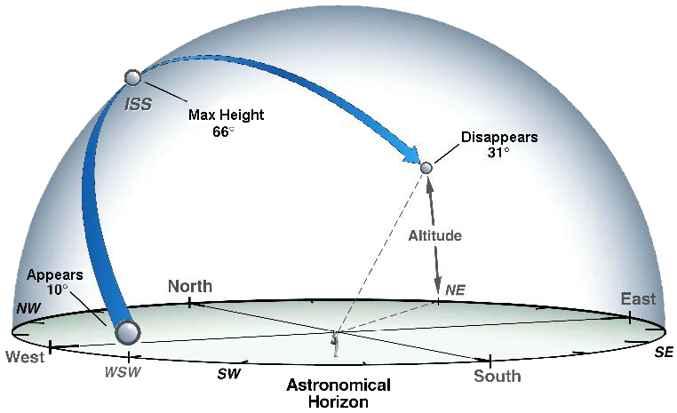

## MMM-ISS

Know when the International Space Station is visible. Based on your latitude and longitude.

## Cool Fact

The International Space Station travels in orbit around Earth at a speed of roughly 17,150 miles per hour.
That's about 5 miles per second! This means the ISS orbits Earth (and sees a sunrise) once every 92 minutes!

## Can I see it without a telescope?

You sure as hell can! Every so often, you can see the ISS in your night sky. To us on Earth, it looks like 
a bright star moving quickly above the horizon. Visible to the naked eye, the ISS is best seen at dawn and dusk.
It is the third brightest object in the sky. 

## What you get

* The current altitude of the ISS

* The current velocity of the ISS

* The date and time of the next sighting for your location

* Length of time the ISS will be visible

* The direction you should be looking to see the ISS when it appears

## Examples

 

## Installation

* `git clone https://github.com/mykle1/MMM-ISS` into the `~/MagicMirror/modules` directory.

* No dependencies, yet! :-)


## Config.js entry and options

### Location not in the United States

```
{
disabled: false,
module: 'MMM-ISS',
position: 'top center',
config: {
    country: "Japan",
    regionState: "",       // Leave empty "".
    city: "Tokyo",
    lat: "42.6977",              // latitude
    lng: "23.3219",             // longitude
    units: "km",                   // mi = miles, mph / km = kilometers, km/h
    useHeader: false,              // true if you want a header
    header: "",                    // Any text you want. useHeader must be true
    updateInterval: 5 * 60 * 1000,
  }
},
```
### Location inside the United States

```
{
disabled: false,
module: 'MMM-ISS',
position: 'middle_center',
config: {
    country: "United States",
    regionState: "New York",       // Requires state
    city: "New York",
    lat: "40.565819",              // latitude
    lng: "-74.117500",             // longitude
    units: "mi",                   // mi = miles, mph / km = kilometers, km/h
    useHeader: false,              // true if you want a header
    header: "",                    // Any text you want. useHeader must be true
    updateInterval: 5 * 60 * 1000,
   }
},
```
